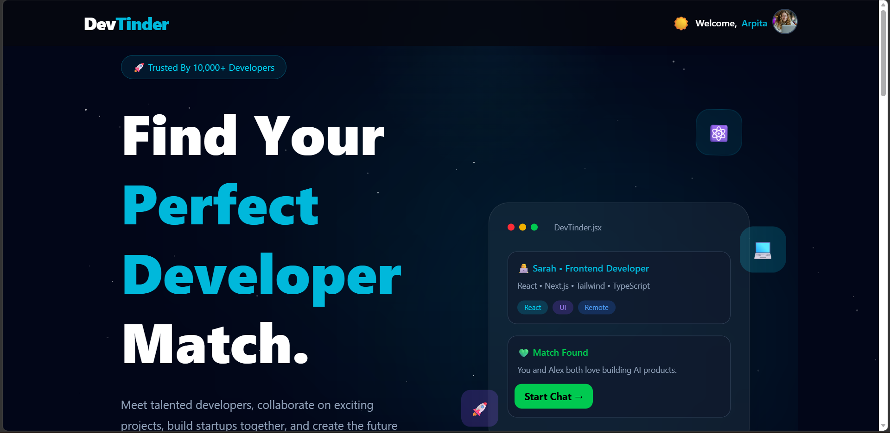
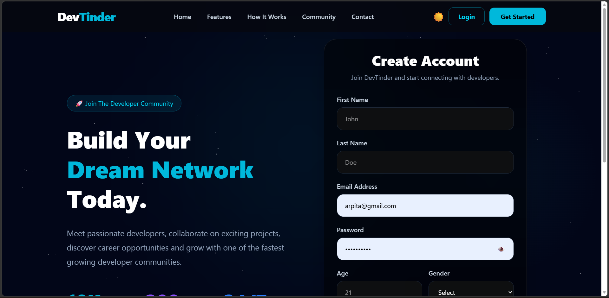
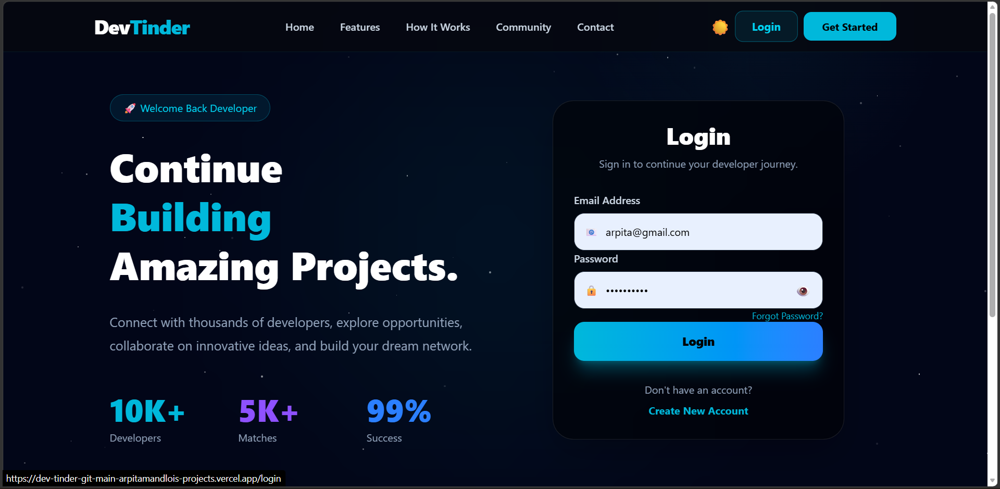
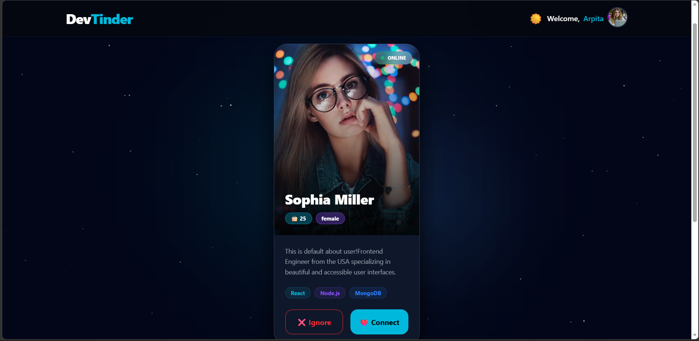
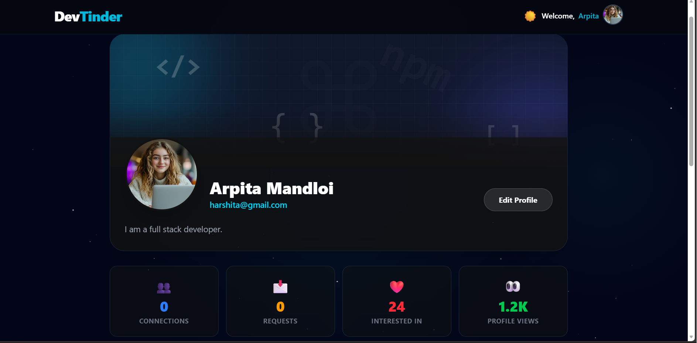

# 🚀 DevTinder


DevTinder is a full-stack MERN web application inspired by Tinder, designed exclusively for developers. It helps developers discover, connect, and build meaningful professional relationships based on their skills, interests, and profiles. Users can send connection requests, accept or reject requests, manage their network, and explore other developer profiles in a clean and modern interface.

---

## 📌 Project Overview

Finding like-minded developers for collaboration, networking, hackathons, or career opportunities can be difficult. DevTinder simplifies this process by providing a platform where developers can create profiles, showcase their skills, and connect with others.

Whether you're looking for a coding partner, a project teammate, or simply expanding your professional network, DevTinder makes connecting easier.

---

## 🌐 Live Demo

🚀 **Live Application:**  
https://dev-tinder-git-main-arpitamandlois-projects.vercel.app

💻 **GitHub Repository:**  
https://github.com/ArpitaMandloi/DevTinder

## ✨ Features

* 👤 User Authentication (Sign Up & Login)
* 🔐 Secure Authentication using JWT
* 🍪 Secure Cookie-based Authentication
* 📝 Create and Update Developer Profile
* 🖼️ Upload Profile Information
* 💻 Add Skills and About Section
* 🔍 Browse Developer Profiles
* ❤️ Send Connection Requests
* ✅ Accept or Reject Connection Requests
* 🤝 View Your Connections
* 📩 Manage Incoming Connection Requests
* 🌙 Modern and Responsive UI
* ⚡ Real-time Smooth User Experience
* 🔒 Protected Routes
* 📱 Mobile-Friendly Design
* ☁️ Fully Deployed on Vercel & Render

---

## 🛠️ Tech Stack

### Frontend

* React.js
* Vite
* Tailwind CSS
* DaisyUI
* Axios
* React Router

### Backend

* Node.js
* Express.js
* MongoDB
* Mongoose
* JWT Authentication
* bcrypt
* Cookie Parser
* CORS

---

## ☁️ Deployment

| Service | Platform |
|----------|----------|
| Frontend | Vercel |
| Backend | Render |
| Database | MongoDB Atlas |

----

## 📂 Project Structure

```text
DevTinder/
│
├── DevTinder-Backend/
│
└── DevTinder-Frontend/
```

---

## 🚀 Installation

### Clone the Repository

```bash
git clone https://github.com/your-username/DevTinder.git
```

### Backend

```bash
cd DevTinder-Backend
npm install
npm run dev
```

### Frontend

```bash
cd DevTinder-Frontend
npm install
npm run dev
```

---

## 🎯 Future Enhancements

* 💬 Real-time Chat
* 🔔 Push Notifications
* 📹 Video Calling
* 🌐 Advanced Developer Search & Filters
* ⭐ Profile Verification
* 📌 Bookmark Developers
* 🤖 AI-Based Developer Recommendations

---

## 👩‍💻 Developed By

**Arpita Mandloi**

If you like this project, don't forget to ⭐ the repository.
## 📷 Screenshots

### 🏠 Home Page



---

### 📝 Signup Page



---

### 🔐 Login Page



---

### ❤️ Developer Feed



---

### 👤 Profile Page

